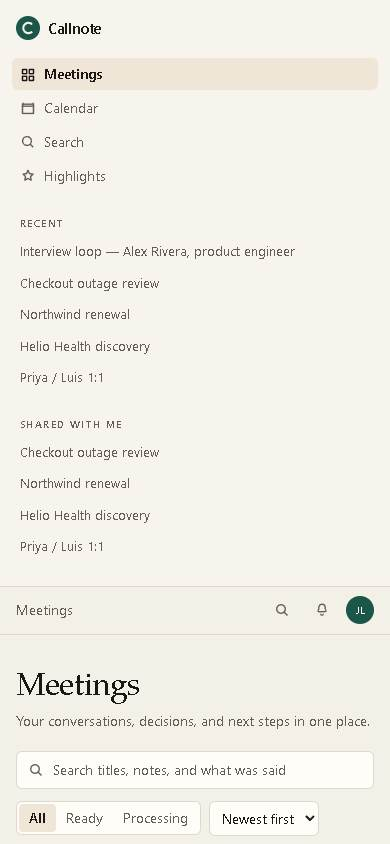
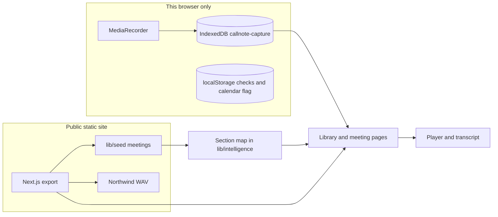

# Callnote

Callnote is a meeting workspace: a library of calls, a player tied to the transcript, structured notes, action items, highlights, search, and a public clip link.

There is no account. The seeded meetings are in the repository, so the deployed site works without a session and without an API key.

**Live:** https://habinrahman.github.io/Callnote/

**Source:** https://github.com/habinrahman/Callnote


## Why Callnote?

The useful part of a meeting is not the recording. It is the moment you can point at, the decision, and the person who owns the next step.

Callnote is built around that job. You open a finished call, move the clock, read the line that matches, and leave with owners and a link. A second path records the microphone in the browser and files the result locally. That path does not join Zoom, Google Meet, or Teams, and it does not call a model. The assignment allows a stubbed notetaker. Callnote uses that permission and says so in the product.

## Product at a glance

```text
Meeting → Capture → Transcript → Notes → Actions → Highlights → Search → Share
```

| Step | What you can do now |
| --- | --- |
| Meeting | Open a seeded call from the library, or a browser capture from this machine |
| Capture | Demo calendar, then a real `MediaRecorder` session. The transcript is a timed script |
| Transcript | Speaker, timestamp, click to seek, in-transcript filter |
| Notes | Authored summary, decisions, topics, follow-ups. Templates change the headings |
| Actions | Owner, due date, checkbox stored in this browser |
| Highlights | Seeded marks on the public site. New marks stored with the capture |
| Search | Literal match on titles, notes, actions, and transcript lines |
| Share | Public clip pages for seeded clips. Captured clips stay in this browser |

## Demo

Open the live site and use this order. It takes about two minutes. There is no walkthrough video in the repository.

1. [Library](https://habinrahman.github.io/Callnote/). Checkout outage review shows **1 hr** and eight people. Interview loop — Alex Rivera stays on **Processing**.
2. [Northwind renewal](https://habinrahman.github.io/Callnote/meetings/northwind-renewal/). Press Play. The spoken file is short; the cue map moves the transcript with it. Click a line. Copy link. The URL includes `/Callnote/` and `?t=`.
3. [Checkout outage review](https://habinrahman.github.io/Callnote/meetings/reliability-review/). Switch the template to **Incident review**. Read customer impact, the deploy freeze, and the owners. This meeting has no audio file. Play moves a silent clock.
4. [Jonah's renewal decision](https://habinrahman.github.io/Callnote/share/northwind-decision/). A public clip, no login.
5. [Search](https://habinrahman.github.io/Callnote/search/) for `error budget`.
6. [Calendar](https://habinrahman.github.io/Callnote/calendar/). Connect is a demo. Start Callnote asks for the microphone and does not call Google or Microsoft.


## Feature showcase

### Meeting library

The home page lists seeded meetings and, in this browser, any captures in IndexedDB. A card shows when it happened, how long it ran, who was there, a preview, and how many actions are still open. Alex Rivera is the processing fixture: the card is visible, the transcript is empty, and it never becomes ready.



### Meeting workspace

`/meetings/[id]/` is the review surface. The player, transcript, and notes are one page. On a narrow viewport the transcript stays above the summary.

### Playback

Northwind is the only seeded meeting with audio: `public/audio/northwind-renewal.wav`. The file is concatenated spoken lines, about 108 seconds, not a 14-minute room recording. `lib/audio/northwind-demo.ts` maps each line's meeting timestamp onto a span of that file. Seeking waits until the browser can seek that far, so the clock does not snap back to the start.

Every other seeded meeting has no media. Play runs a timer. Gaps longer than 1.5 seconds are skipped so the transcript keeps advancing. The duration on screen is the meeting's `durationSec`, not `audio.duration`. The waveform is decorative.

### Transcript

Each line has a speaker, a start, and an end from `layOut` in `lib/seed/build.ts`. The active line is the one that contains the playhead. Clicking a line seeks and writes `?t=` on the URL. Refresh and paste keep that position. The filter is a substring on the lines in view.

### Structured notes

Summaries, decisions, topics, actions, and follow-ups are written in `lib/seed/meetings.ts`. Nothing generates them at runtime. They match the transcripts because they were written against them, not because a job checks that.

### Templates

The select is backed by `lib/intelligence/present.ts`. It maps a template id onto a list of sections: prose, decisions, actions, topics, moments, or follow-ups. Some sections show a slice of those arrays (`take` / `skip`).

Use **Incident review** on Checkout outage review. That meeting has an incident template, so the summary text changes with the headings: incident summary, customer impact, root cause, timeline, technical signals, mitigations, follow-ups.

On a meeting that does not store the template you picked, the headings still change and the prose stays the meeting's first template. `follow-up`, `mutual-plan`, and `coaching` change the written summary and keep the general headings. This is a view over stored notes. It is not a model rewrite.


### Action items

Each item has a task, an owner, an optional due date, and a timestamp. The checkbox is stored under `localStorage` key `fanthom-actions-${meetingId}`. The key name is historical. Renaming it would drop checks already saved in a browser. Checks are not synced.

### Highlights

Seeded highlights sit on the timeline and on [/highlights/](https://habinrahman.github.io/Callnote/highlights/). Opening one seeks the meeting. During a capture you can type a short title and mark the current time. Those marks are saved on the IndexedDB meeting and are not part of the public site.


### Search

[/search/](https://habinrahman.github.io/Callnote/search/) scans titles, template summaries and follow-ups, action tasks and owners, and up to three transcript lines per meeting. Matching is case-insensitive substring. Processing meetings are skipped. Decisions and highlight labels are found only when the same words appear in a summary or a line. Captured meetings are searched only after IndexedDB loads in that browser.


### Public clips

Four seeded clips are static pages:

- https://habinrahman.github.io/Callnote/share/northwind-decision/
- https://habinrahman.github.io/Callnote/share/reliability-freeze/
- https://habinrahman.github.io/Callnote/share/helio-hipaa/
- https://habinrahman.github.io/Callnote/share/priya-secondary/

Copy clip link builds an absolute URL with the `/Callnote/` prefix. A path without that prefix 404s on GitHub Pages. Captured clip pages (`/share/captured/`) only play back in the browser that holds the recording.


### Calendar

[/calendar/](https://habinrahman.github.io/Callnote/calendar/) lists demo events. Connect stores `{ provider, name }` in `localStorage` (`callnote-calendar-demo`) and shows "Demo connection". The page states that Callnote does not call Google or Microsoft. Checkout outage review on the calendar is 60 minutes and links to the seeded meeting. The other events can start a local capture.


### Browser capture

Start Callnote opens a ready screen, then a live screen that calls `getUserMedia` and `MediaRecorder` (`audio/webm;codecs=opus`, then webm, then mp4). Stop shows a processing panel for about 1.6 seconds, writes the blob plus the scripted lines and the prewritten notes, and opens `/meetings/captured/?id=`. The processing panel says this is not speech-to-text. If the microphone is denied, the page stays on a denied state instead of spinning.


## Reviewer walkthrough

If you have five minutes, stay on the live site.

1. Library: point at **1 hr**, eight participants, and the processing card.
2. Northwind: play, seek a transcript line, copy the meeting link, open the copied URL.
3. Outage review: Incident review template, one action checkbox, one highlight.
4. Open the [freeze clip](https://habinrahman.github.io/Callnote/share/reliability-freeze/) and the [renewal clip](https://habinrahman.github.io/Callnote/share/northwind-decision/).
5. Search `migration check` or `error budget`.
6. Optional: calendar connect, ten seconds of microphone, stop, play the capture back. Say that the words on screen were the demo script.

## Architecture



Seeded pages are HTML and JS produced by `next build` with `output: "export"`. GitHub Pages serves the `out/` directory. The client bundle reads IndexedDB and `localStorage` after load. There is no application server and no database.

## Repository structure

| Path | What it is |
| --- | --- |
| `app/` | Routes. Static pages, meeting, share, calendar, capture |
| `components/` | Shell, library, player, transcript, workspace, capture UI |
| `lib/domain/` | Types, UTC formatting, seeded queries. No React |
| `lib/seed/` | Meetings and the `layOut` timing helper |
| `lib/intelligence/` | Template section map. No network |
| `lib/audio/` | Northwind cue table |
| `lib/capture/` | Calendar demo data, IndexedDB, captured search |
| `public/audio/` | `northwind-renewal.wav` |
| `scripts/verify-demo.mjs` | Browser checks against a built site |
| `.github/workflows/pages.yml` | Build and GitHub Pages deploy |
| `.agent-logs/` | Assignment agent-capture logs. Do not delete |
| `docs/PRODUCT-REVIEW.md` | Internal engineering review |

The npm package name is `fanthom`. That name is internal. The product name is Callnote.

## Data model

Seeded `Meeting` (`lib/domain/types.ts`): id, title, start, duration, status (`ready` or `processing`), speakers, transcript segments, highlights, actions, decisions, topics, moments, summary templates, clips.

`CapturedMeeting` (`lib/capture/db.ts`): id, source event, participants, script lines, highlights, notes, and an audio `Blob`. It is not the same type as `Meeting`. Captured rows never enter the static export.

## Route map

| Route | Role |
| --- | --- |
| `/` | Library |
| `/search/` | Literal search |
| `/highlights/` | Seeded highlights, plus captured ones in this browser |
| `/meetings/northwind-renewal/` | Audio demo |
| `/meetings/reliability-review/` | Eight people, about one hour, no audio |
| `/meetings/helio-discovery/` | Discovery notes |
| `/meetings/priya-luis-1on1/` | 1:1 notes |
| `/meetings/alex-interview/` | Stays in processing |
| `/meetings/captured/?id=` | A recording stored in this browser |
| `/share/northwind-decision/` and the other clip ids | Public clips |
| `/share/captured/?id=&h=` | Local clip only |
| `/calendar/` | Demo calendar |
| `/calendar/[id]/` | Ready to capture |
| `/calendar/[id]/live/` | Microphone session |

On GitHub Pages every path is under `/Callnote/`. Example: `https://habinrahman.github.io/Callnote/meetings/northwind-renewal/`.

`usePathname()` returns the path without the base path. Next.js `Link` adds the prefix. Copied links add it in `copyLink` before `new URL`, because a leading slash would otherwise replace the project path.

## Engineering deep dive

**Static first.** Seeded content is build input. New captures cannot create new static paths, so they reuse `/meetings/captured/` and put the id in the query string.

**Base path.** `NEXT_PUBLIC_BASE_PATH=/Callnote` is set in the Pages workflow. Local `npm run dev` leaves it empty, so the dev server is at `/`. A production build without the variable also omits the prefix. The live site always sets it.

**Playback.** `usePlayback` either drives an `Audio` element or a timer. Cue helpers convert between file time and meeting time. `pendingAudio` blocks `timeupdate` from overwriting a seek that is not buffered yet.

**Transcript clock.** `layOut` gives each line a spoken duration from its word count, then splits the remaining meeting duration into gaps. Highlight and clip ranges use segment indexes, so they stay on the right line when the duration changes. They do not represent continuous speech across a full hour.

**Capture.** Real microphone bytes. Scripted words. Prewritten notes. The processing delay is a fixed timeout, then `router.push` to the captured meeting.

**Search.** One loop in `searchMeetings`. No index file, no vectors.

**Verification.** `scripts/verify-demo.mjs` drives installed Chrome through the library, Northwind playback and seek, the action checkbox, the public clip, and the long meeting. It is not wired as an npm script. `DEMO_URL` overrides the base. `npx tsc --noEmit` is the typecheck. There is no ESLint script.

**Deployment.** Push to `master` runs `.github/workflows/pages.yml`: `npm ci`, `npm run build` with the base path, upload `out/`, deploy Pages.

## Product decisions

The library is the front door because a reviewer can judge the product without a microphone. Northwind carries audio because one synced meeting is enough to prove the player. The outage review carries length and headcount because producing an hour of speech was the wrong use of the time. Alex Rivera stays processing so that state is visible without trapping a real capture there.

Templates exist so the same notes can be read as an incident, a sale, a discovery, or an interview. They are honest only when the meeting actually has that writing. The incident template on the outage review is the one to show.

## Trade-offs

| Decision | Reason | Sacrifice | Benefit |
| --- | --- | --- | --- |
| Static export | Public URL with no server to run | No accounts, no private clips, no new HTML routes per capture | The site is inspectable immediately |
| Authored notes | No model key and no failure during a demo | Cannot claim live intelligence | The walkthrough is repeatable |
| Browser recorder | The brief allows a stubbed bot | The app never joins a call | The microphone path is real and labeled |
| IndexedDB | Matches a static host | Captures are not shared and not backed up | No database to provision |
| One WAV | Time | Four meetings are silent | Northwind playback is specific, not a fake equalizer |

## Notes, not a model

No LLM is called. No API key is shipped. Summaries are not generated on request. Search is not semantic. Highlights are not extracted by a job.

`lib/intelligence/present.ts` is the seam. It returns section kinds. A future caller could fill those kinds from a model. This repository does not.

## Recording

| Kind | Where | What it is |
| --- | --- | --- |
| Seeded audio | Northwind WAV plus cue table | Spoken lines, mapped onto the meeting clock |
| Browser audio | `MediaRecorder` blob in IndexedDB | Your microphone, played back locally |
| Silent clock | Other seeded meetings | Timer and transcript only |
| Meeting bot | Not built | No Zoom, Meet, or Teams integration |

## Privacy

Public: the seeded meetings, the four clips, the WAV, and this source.

Local: action checkmarks, the demo calendar flag, and captured audio, lines, notes, and highlights.

Not implemented: accounts, private links, encryption beyond the browser, revocation, or a server.

A backend would be required for real calendar OAuth, a bot, sharing a capture with someone else, and any model call whose key should not live in the client.

## Testing

```bash
npm install
npx tsc --noEmit
```

Production export, from the repository root:

```bash
# PowerShell
$env:NEXT_PUBLIC_BASE_PATH="/Callnote"
npx next build
```

Serve `out/` under a `/Callnote/` prefix and run:

```bash
# PowerShell
$env:DEMO_URL="http://127.0.0.1:3466/Callnote"
node scripts/verify-demo.mjs
```

The script expects Google Chrome at `C:\Program Files\Google\Chrome\Application\chrome.exe`. It fails on `pageerror`. Favicon load noise is ignored.

Local development, without the Pages prefix:

```bash
npm run dev
```

Open http://localhost:3000.

## Deployment

GitHub Pages: https://habinrahman.github.io/Callnote/

The workflow sets `NEXT_PUBLIC_BASE_PATH` to `/Callnote`. Styles, scripts, the WAV, and routes are all under that prefix. `https://habinrahman.github.io/meetings/...` is the wrong host path and returns 404.

## 8x assignment mapping

| Requirement | In this repo |
| --- | --- |
| Meeting library | Built. `/` |
| Connect a calendar | Demo only. `localStorage`. Copy says Google and Microsoft are not called |
| Notetaker joins the meeting | Not built. A demo event opens a browser recorder |
| Record | Built locally. `MediaRecorder` |
| Play against the transcript | Built. Audio on Northwind. Silent clock elsewhere |
| Summary | Built from seeded notes. No model |
| Template switching | Built as a section map. Strongest on the incident template |
| Action items | Built. Browser-local checks |
| Highlights | Built. Seeded marks are public. New marks are local |
| Search | Built. Literal. Not semantic |
| Share a clip | Built for four seeded clips |
| About 8 people and 1 hour | Built. Checkout outage review. No audio |
| Responsive | Built. Player, then transcript, then notes |
| Public deployment | Built. GitHub Pages under `/Callnote/` |
| Public repository | https://github.com/habinrahman/Callnote |
| Agent logs | `.agent-logs/` and `.cursor/hooks.json` |
| Walkthrough video | Not in the repository. Record it from the live site |

A longer review is in [docs/PRODUCT-REVIEW.md](docs/PRODUCT-REVIEW.md).

## Known limitations

Intentional:

- No OAuth, no meeting bot, no accounts, no model.
- One seeded audio file.
- Alex Rivera never leaves Processing.
- Captures and checkmarks stay in the browser that created them.

Technical:

- Template headings can outrun the copy when the meeting has no template with that id.
- `follow-up`, `mutual-plan`, and `coaching` do not change section headings.
- Search returns at most three transcript hits per meeting and skips highlight labels as their own type.
- The Highlights page still says moments were "extracted". They were written in the seed.
- Search's subtitle mentions decisions. The indexer has no decision field. A decision is found when the same words are in a summary or a transcript line.
- A failed IndexedDB write during processing leaves the processing panel up.

## Future work

Worth doing only after a real user needs it:

- One section renderer shared by seeded and captured meetings.
- Template ids that only appear when the prose was written for them.
- A warning when IndexedDB quota fails.
- Private sharing, which requires a backend.

Not worth doing for this assignment: a bot, OAuth, or a model call added so the README can use the word AI.

## Contributing

This repository is an assignment snapshot. Issues and pull requests are not part of the submission path.

## Author

Habin Abdul Rahman — https://github.com/habinrahman
