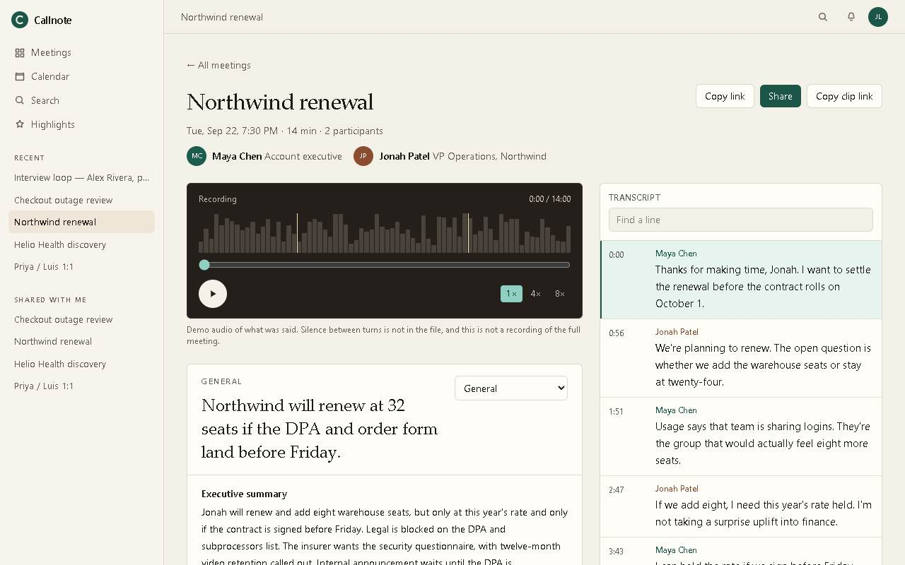
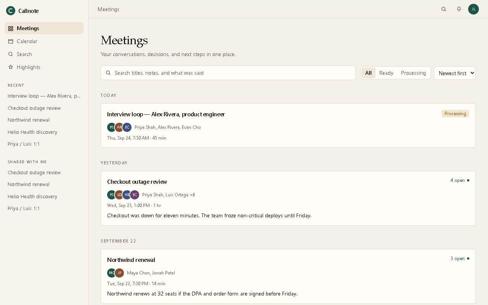
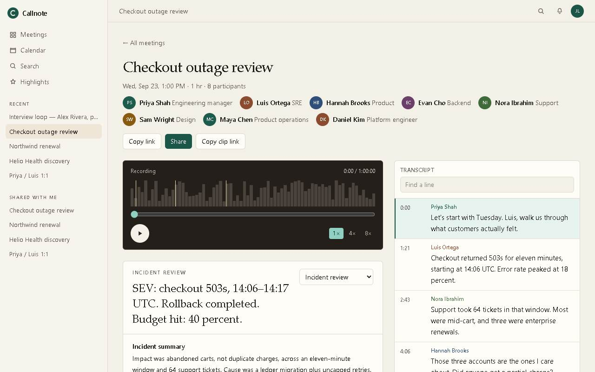
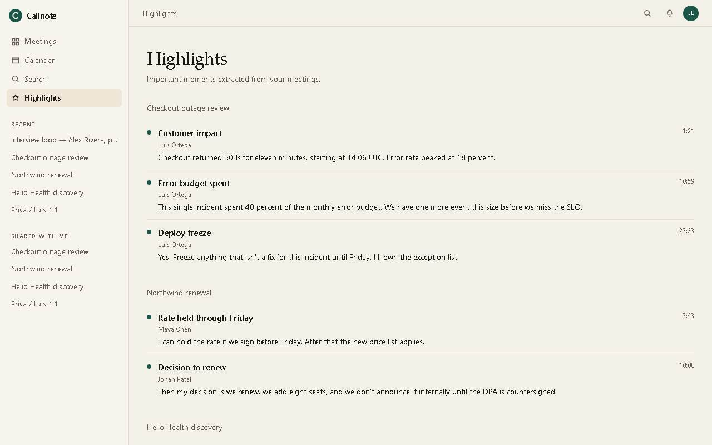
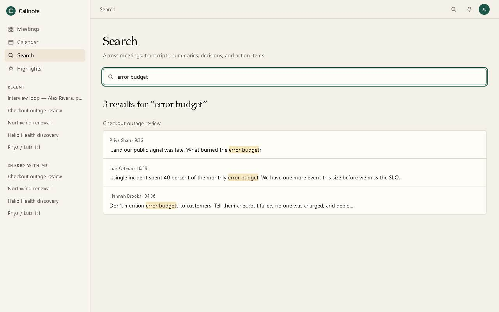
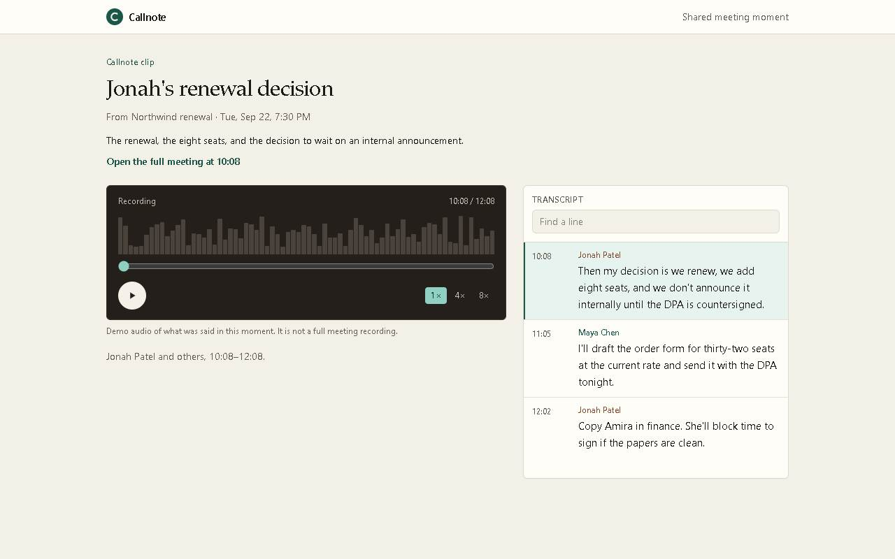
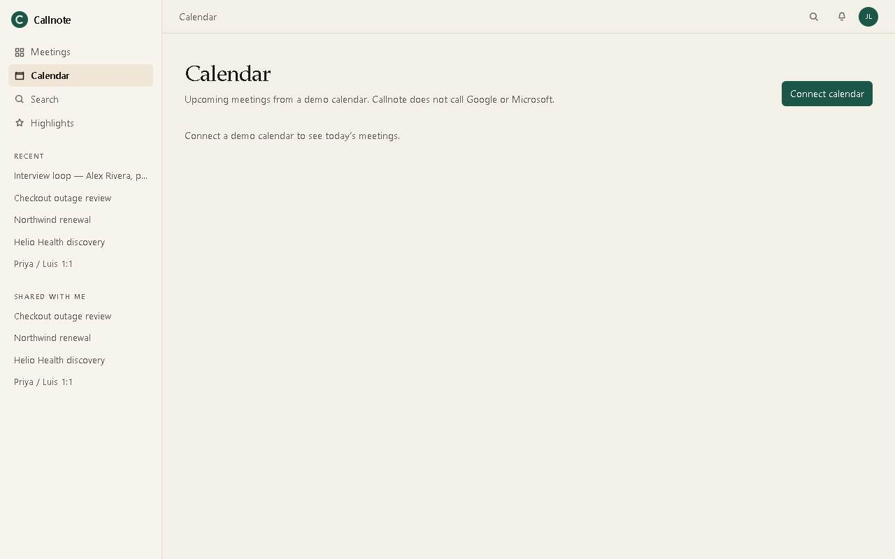
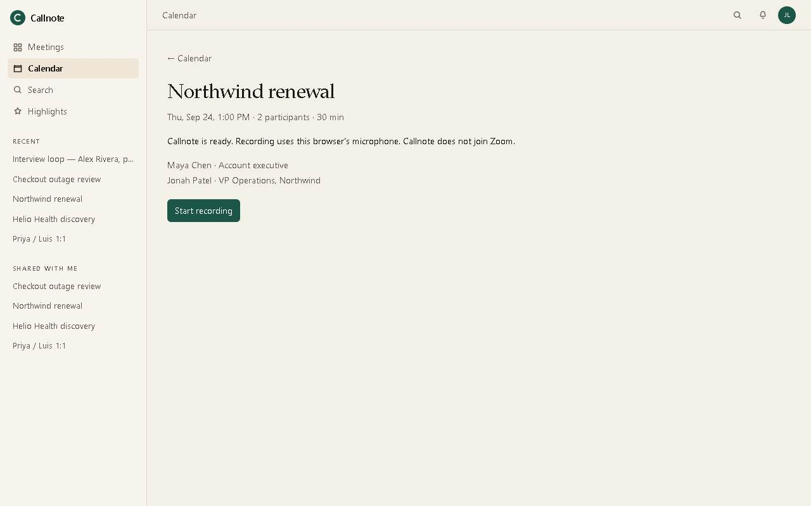
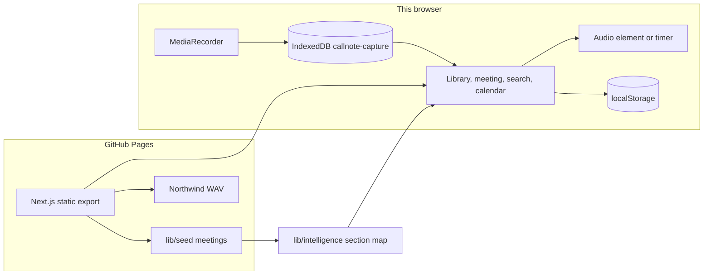
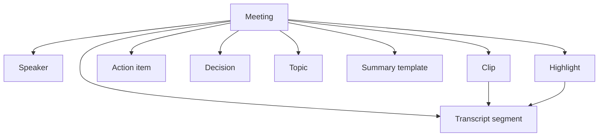

# Callnote

A meeting workspace for the hour after the call: the recording clock, the line that was said, the decision, the owner, and a link you can send.

[](https://habinrahman.github.io/Callnote/)
[](https://github.com/habinrahman/Callnote)
[](https://nextjs.org/)
[](https://www.typescriptlang.org/)
[](https://github.com/habinrahman/Callnote/blob/master/.github/workflows/pages.yml)

Callnote is a public, account-free demo of that workflow. Seeded meetings ship in the repository. One of them plays a real audio file in time with the transcript. Notes are written into the data, not produced by a model. A second path records the microphone in the browser and keeps that recording on that machine.

**Live demo:** https://habinrahman.github.io/Callnote/

**Repository:** https://github.com/habinrahman/Callnote



> Open [Northwind renewal](https://habinrahman.github.io/Callnote/meetings/northwind-renewal/) and press Play. That is the fastest way to see the product.

## Why Callnote?

The useful part of a meeting is the moment you can point at, the decision, and the person who owns the next step.

Callnote is built around the post-meeting pass. You open a finished call, move the clock, read the matching line, and leave with owners and a link. Calendar connect and a meeting bot are demoed, not integrated. The assignment allows a stubbed notetaker. The product says so on the calendar page and on the capture screen.

## Product at a glance

```text
Library → Meeting → Transcript → Notes → Actions → Highlights → Search → Clip
```

| Step | What works today |
| --- | --- |
| Library | Five seeded meetings, plus captures stored in this browser |
| Meeting | Player, speakers, duration, notes, highlights |
| Transcript | Speaker, time range, active line, click to seek, in-transcript filter |
| Notes | Authored summary, decisions, topics, follow-ups. A template changes the headings |
| Actions | Owner, due date, timestamp. The checkbox stays in this browser |
| Highlights | Seeded marks seek the player. Marks made during capture stay in IndexedDB |
| Search | Case-insensitive match on titles, notes, actions, and transcript lines |
| Clip | Four public clip pages. No viewer account |

Capture sits beside that loop. It is a real microphone recording with a scripted transcript, not a bot that joined the call.

## Try the live demo

About two minutes. No install and no account.

1. Open the [library](https://habinrahman.github.io/Callnote/). Checkout outage review is **1 hr**. Interview loop — Alex Rivera stays on **Processing**.
2. Open [Northwind renewal](https://habinrahman.github.io/Callnote/meetings/northwind-renewal/) and press Play. The highlighted transcript row follows the file.
3. Click a line. The URL gains `?t=`.
4. Read **Executive summary** and check one action.
5. Open [Search](https://habinrahman.github.io/Callnote/search/) and type `error budget`.
6. Open [Jonah's renewal decision](https://habinrahman.github.io/Callnote/share/northwind-decision/).
7. Open [Checkout outage review](https://habinrahman.github.io/Callnote/meetings/reliability-review/) and switch the template to **Incident review**. Do not expect audio on that meeting.

| Stop | URL |
| --- | --- |
| Library | https://habinrahman.github.io/Callnote/ |
| Calendar | https://habinrahman.github.io/Callnote/calendar/ |
| Search | https://habinrahman.github.io/Callnote/search/ |
| Highlights | https://habinrahman.github.io/Callnote/highlights/ |
| Northwind | https://habinrahman.github.io/Callnote/meetings/northwind-renewal/ |
| Outage review | https://habinrahman.github.io/Callnote/meetings/reliability-review/ |
| Public clip | https://habinrahman.github.io/Callnote/share/northwind-decision/ |

<!-- Walkthrough video: when a public Loom (or similar) URL exists, add it here as a markdown link. Do not link docs/demo/callnote-demo.mp4 until that file is actually committed. -->

There is no walkthrough file in this repository. The live path above is the demo.

## Feature showcase

### Meeting library

The home page lists seeded meetings and, after load, any captures in IndexedDB. A card shows when the meeting happened, how long it ran, who was there, a one-line preview, and how many actions are still open.

Alex Rivera is the processing fixture. The card is visible. The transcript is empty. It never becomes ready. That is intentional, so the state can be reviewed without trapping a new recording there.

The sidebar list labeled **Shared with me** is the same seeded meetings again. It is not an inbox and it does not mean someone sent you a meeting.



### Synchronized playback

Northwind is the only seeded meeting with audio: [`public/audio/northwind-renewal.wav`](public/audio/northwind-renewal.wav). The file is concatenated spoken lines, about 108 seconds, not a room recording of the full 14-minute meeting. [`lib/audio/northwind-demo.ts`](lib/audio/northwind-demo.ts) maps each line's meeting time onto a span of that file.

Seeking waits until the browser can seek that far before it assigns `audio.currentTime`. Otherwise Chrome can snap the element back to the start and the transcript follows it.

Every other seeded meeting has no media file. Play runs a timer. Gaps longer than 1.5 seconds are skipped so the transcript keeps moving. The duration on screen is `durationSec` from the meeting, not `audio.duration`. The waveform is decorative. It is not drawn from samples.

### Transcript

Each line has a speaker, a start, and an end. `layOut` in [`lib/seed/build.ts`](lib/seed/build.ts) estimates spoken time from the word count, then spreads the rest of the meeting across the gaps. The active line is the one that contains the playhead. Clicking a line seeks and writes `?t=` so refresh and paste reopen that moment. The filter is a substring over the lines on the page.

### Structured notes

Summaries, decisions, topics, actions, moments, and follow-ups are fields on the meeting in [`lib/seed/meetings.ts`](lib/seed/meetings.ts). Nothing generates them at request time. They match the transcripts because they were written against those lines.



### Templates

The select is driven by [`lib/intelligence/present.ts`](lib/intelligence/present.ts). Five structures change the section headings:

| Structure | Headings |
| --- | --- |
| General | Executive summary, Decisions, Action items, Key topics, Follow-ups |
| Incident review | Incident summary, Customer impact, Root cause, Timeline, Technical signals, Mitigations, Follow-ups |
| Sales | Executive summary, Customer needs, Pain points, Objections, Opportunities, Next steps |
| Customer discovery | Customer context, Problems, Current workflow, Pain points, Requirements, Open questions, Follow-ups |
| Interview | Candidate summary, Experience discussed, Strengths, Concerns, Technical signals, Questions, Recommendation |

Checkout outage review stores an incident template, so **Incident review** changes the summary text as well as the headings. On a meeting that does not store the id you picked, the headings still change and the prose stays the meeting's first template. Some sections show a slice of the same arrays (`take` / `skip`). That can put a heading on a fact that was not written for that heading.

Seeded template names **Customer follow-up**, **Mutual plan**, and **1:1** swap the written summary and keep the general headings. `structureFromTemplate` does not have a section list for those ids.

### Highlights

Seeded highlights sit on the player and on the [highlights page](https://habinrahman.github.io/Callnote/highlights/). Opening one seeks the meeting. They are authored fields. The page subtitle still says they were extracted. They were not.

During a capture you can type a short title and mark the current time. Those marks are saved on the IndexedDB row and are not part of the public site. Clicking one seeks local playback.



### Search

[Search](https://habinrahman.github.io/Callnote/search/) scans, per ready meeting:

- the title
- each template's headline, summary, and follow-ups
- action task and owner
- up to three transcript lines

Matching is `String.includes` on lowercased text. A timestamped hit links to `/meetings/{id}?t=`. Processing meetings are skipped. Highlight labels and decisions are not their own index. A decision is found when the same words appear in a summary or a line. The search subtitle mentions decisions. That is broader than the indexer.

Captured meetings are searched only after IndexedDB loads in that browser. A fresh browser only hits the seed.



### Public clips

Four seeded clips are static pages. No viewer account.

| Clip | URL |
| --- | --- |
| Jonah's renewal decision | https://habinrahman.github.io/Callnote/share/northwind-decision/ |
| Reliability freeze | https://habinrahman.github.io/Callnote/share/reliability-freeze/ |
| Helio HIPAA | https://habinrahman.github.io/Callnote/share/helio-hipaa/ |
| Priya / Luis secondary | https://habinrahman.github.io/Callnote/share/priya-secondary/ |

The clip clamps playback to a start and an end taken from transcript segments. Northwind's clip uses the same WAV. **Copy link** and **Copy clip link** build an absolute URL with the Pages prefix. `https://habinrahman.github.io/meetings/...` omits `/Callnote/` and returns 404.

`/share/captured/` plays a blob from this browser. Sending that URL to someone else does not send the audio.



### Calendar

[Calendar](https://habinrahman.github.io/Callnote/calendar/) is a demo list. **Connect calendar** writes `{ provider, name: "Jordan Lee" }` to `localStorage` (`callnote-calendar-demo`) and shows **Demo connection**. The page says Callnote does not call Google or Microsoft.

Checkout outage review on the calendar is **60 min**, eight participants, labeled Google Meet, with **Open saved meeting** into the seeded workspace. Other cards can open **Start Callnote**. The ready screen says recording uses this browser's microphone and does not join the named platform. **Notetaker scheduled** on the Helio card is a label, not a bot.



### Browser capture

**Start recording** calls `getUserMedia` and `MediaRecorder`, preferring `audio/webm;codecs=opus`, then webm, then mp4. Stop shows **Processing meeting** for about 1.6 seconds, writes the blob plus the scripted lines that had already started and the prewritten notes, and opens `/meetings/captured/?id=`. The panel says this is not speech-to-text. If the microphone is denied, the page stays on a denied state.



## Screenshot gallery

| View | What it shows |
| --- | --- |
| [Library](docs/screenshots/library.jpg) | Duration, people, preview, open actions, Processing |
| [Northwind workspace](docs/screenshots/northwind-workspace.jpg) | Player and transcript on the audible meeting |
| [Incident notes](docs/screenshots/incident-notes.jpg) | Eight participants and the incident template |
| [Highlights](docs/screenshots/highlights.jpg) | Seeded moments with timestamps |
| [Search](docs/screenshots/search.jpg) | Literal hits for `error budget` |
| [Public clip](docs/screenshots/share-clip.jpg) | A clip with no account |
| [Calendar](docs/screenshots/calendar.jpg) | Demo connection and Start Callnote |
| [Capture ready](docs/screenshots/capture-ready.jpg) | Microphone path, explicitly not a joined call |
| [Library on a phone](docs/screenshots/library-mobile.jpg) | The same library at a narrow width |

## Architecture

Seeded pages are HTML and JavaScript from `next build` with `output: "export"`. GitHub Pages serves the `out/` directory. After load, the client reads IndexedDB and `localStorage`. There is no application server and no database.



| Boundary | Responsibility |
| --- | --- |
| `app/` | Routes. Seeded pages are static. Captures reuse `/meetings/captured/` |
| `components/` | Shell, library, player, transcript, notes, calendar, capture |
| `lib/domain/` | Types, UTC formatting, seeded queries. No React |
| `lib/seed/` | Meeting content and transcript timing |
| `lib/intelligence/` | Template headings. No network |
| `lib/audio/` | Northwind cue table |
| `lib/capture/` | Demo calendar, IndexedDB, captured search |

`usePathname()` returns the path without the base path. `Link` adds `/Callnote/` in the production build. Copied links add it in `copyLink` before `new URL`, because a leading slash would otherwise drop the project path.

## Repository structure

```text
app/                  routes
components/           UI
lib/domain/           types, format, queries
lib/seed/             meetings and layOut
lib/intelligence/     template section map
lib/audio/            Northwind cues
lib/capture/          calendar demo, IndexedDB, captured search
public/audio/         northwind-renewal.wav
scripts/verify-demo.mjs
.github/workflows/pages.yml
.cursor/hooks.json    agent-capture hook for the assignment
.agent-logs/          hook output. Not part of the product
docs/screenshots/     images in this README
docs/PRODUCT-REVIEW.md
```

`.cursor/hooks.json` runs `.cursor/hooks/agent-capture.mjs` on prompt submit, agent response, and stop. The logs in `.agent-logs/` are that capture. They are not used at runtime by Callnote.

## Engineering deep dive

<details>
<summary>Static export and the Pages base path</summary>

The production build sets `NEXT_PUBLIC_BASE_PATH=/Callnote` in [`.github/workflows/pages.yml`](.github/workflows/pages.yml). `next.config.ts` applies that value as `basePath`, with `trailingSlash` and unoptimized images. A local `npm run dev` leaves the variable empty, so the dev server is at `/`.

A copied URL is built as `new URL(basePath + path, origin)`. That is what keeps `https://habinrahman.github.io/Callnote/meetings/northwind-renewal/?t=…` intact. Asset URLs for the WAV use the same prefix.

New captures cannot create new static paths. They open `/meetings/captured/?id=`.

</details>

<details>
<summary>Playback and transcript clock</summary>

`usePlayback` either drives an `Audio` element or a `requestAnimationFrame` clock. Cue helpers convert between file time and meeting time. A pending seek blocks `timeupdate` from overwriting the clock before the media is seekable. The range input ignores programmatic updates unless the pointer or keyboard is on the control.

`layOut` does not store a recorded timeline. Highlight and clip ranges use segment indexes, so they stay on the right line when the meeting duration changes. A 60-minute meeting with a few dozen lines has long gaps. That is how the duration is met.

</details>

<details>
<summary>Capture, IndexedDB, and localStorage</summary>

| Data | Where | Who can see it |
| --- | --- | --- |
| Seeded meetings, clips, WAV | Static export | Anyone with the URL |
| Action checks | `localStorage` key `fanthom-actions-${id}` | This browser |
| Demo calendar flag | `localStorage` key `callnote-calendar-demo` | This browser |
| Captured audio, script, notes, highlights | IndexedDB `callnote-capture` / `meetings` | This browser |
| Playhead | `?t=` | Whoever has a seeded link |

The action-item key still starts with `fanthom-`. Renaming it would drop checks already stored in a browser. The npm package name is also `fanthom`. The product name is Callnote.

Dates render in UTC so the static HTML and the browser agree.

</details>

<details>
<summary>Search and verification</summary>

Search is one loop in `searchMeetings`. There is no index file and no vector store. Captured search is a second loop over IndexedDB rows.

[`scripts/verify-demo.mjs`](scripts/verify-demo.mjs) drives Chrome through the library, Northwind play and seek, an action checkbox, the public clip, and the long meeting. It is a smoke script, not a test suite. There are no unit tests. `npx tsc --noEmit` is the typecheck. There is no ESLint script.

</details>

## Data model

Seeded `Meeting`: id, title, start, `durationSec`, status (`ready` or `processing`), speakers, transcript segments, highlights, actions, decisions, topics, moments, summary templates, clips.

`CapturedMeeting` is a separate type: participants, script lines, highlights, a notes object, and an audio `Blob`. Captured rows are not part of the static export.



A template has an id, name, headline, executive summary, and follow-ups. The section map is not stored on the meeting. It is chosen from the template id at render time.

## Route map

Paths below are the in-app path. On GitHub Pages, prefix `/Callnote`.

| Route | Purpose |
| --- | --- |
| `/` | Library |
| `/search/` | Literal search |
| `/highlights/` | Seeded highlights, plus local captures |
| `/meetings/northwind-renewal/` | Audio demo |
| `/meetings/reliability-review/` | About one hour, eight people, no audio file |
| `/meetings/helio-discovery/` | Discovery notes |
| `/meetings/priya-luis-1on1/` | 1:1 notes |
| `/meetings/alex-interview/` | Stays in processing |
| `/meetings/captured/?id=` | A recording in this browser |
| `/share/northwind-decision/` | Public clip. Same pattern for the other three ids |
| `/share/captured/?id=&h=` | Local clip only |
| `/calendar/` | Demo calendar |
| `/calendar/reliability-review/` | Ready screen. Also `northwind-renewal` and `helio-discovery` |
| `/calendar/[id]/live/` | Microphone session |

## Built for the 8x assignment

Callnote is a Fathom-inspired meeting product for the 8x Software Engineer assignment: an end-to-end post-meeting workspace, with an explicit decision not to build a joining bot. A longer internal review is in [docs/PRODUCT-REVIEW.md](docs/PRODUCT-REVIEW.md).

| Requirement | Status | Where |
| --- | --- | --- |
| Meeting library | Built | `/` |
| Playback and transcript | Built | Northwind WAV and cue map. Other seeded meetings use a silent clock |
| Summary | Built | Seeded templates. No model |
| Templates | Built, constrained | Five heading structures. Incident review is the fair demo |
| Action items | Built | Checkbox in `localStorage` |
| Highlights | Built | Seeded marks are public. New marks are local |
| Search | Built | Literal. Not semantic |
| Public clip | Built | Four static clip pages |
| About 8 people and 1 hour | Built | Checkout outage review. No audio file |
| Responsive layout | Built | Player, then transcript, then notes |
| Calendar connect | Demo | `localStorage`. Does not call Google or Microsoft |
| Notetaker joins the meeting | Not implemented | Ready screen says the microphone does not join the platform |
| Record | Built, local | `MediaRecorder`. Transcript is a timed script |
| Public deployment | Built | GitHub Pages under `/Callnote/` |
| Public repository | Built | https://github.com/habinrahman/Callnote |
| Agent logs | Built | `.agent-logs/` and `.cursor/hooks.json` |
| Walkthrough video | Not in the repo | Record it from the live site |

## Product decisions

The library is the front door so a reviewer can judge the product without a microphone. Northwind carries the only seeded audio file because one synced meeting is enough to prove the player. The outage review carries length and headcount because an hour of produced speech was the wrong use of the time. Alex Rivera stays in processing so that state is visible without blocking a new capture.

Templates exist so the same notes can be read as an incident, a sale, a discovery, or an interview. They are convincing when the meeting actually has that writing. The incident template on the outage review is the one to show.

Public clips exist so a moment can be opened with no account. Captured audio stays local because a static host cannot store a private blob for someone else.

## Trade-offs

| Decision | Reason | Sacrifice | Benefit |
| --- | --- | --- | --- |
| Static export | A public URL with nothing to operate | No accounts, no private clips, no new HTML route per capture | The site can be opened immediately |
| Authored notes | No model key and no failure during a demo | The product cannot claim live intelligence | The same meeting reads the same way every time |
| Browser recorder | The brief allows a stubbed bot | The app never joins a call | The microphone path is real and labeled |
| IndexedDB | Fits a static host | Captures are not shared and not backed up | No database to run |
| One WAV | Time | Four meetings are silent | Northwind playback is specific |

## Notes, not a model

No external model is called. No API key is read. Summaries are not requested from a service. Search is not semantic. Highlights are not extracted by a job.

[`lib/intelligence/present.ts`](lib/intelligence/present.ts) is the seam. It returns section kinds: prose, decisions, actions, topics, moments, or a list. A later caller could fill those kinds from a model. This repository does not.

## Privacy

Public: every seeded meeting, the four clips, the WAV, and this source. There is no auth wall.

Local: action checks, the demo calendar flag, and captured audio, lines, notes, and highlights.

Not implemented: accounts, private links, revocation, or encryption beyond what the browser already does.

A backend would be required for calendar OAuth, a bot, sharing a capture with another person, and any model call whose key must not ship in the client.

This is a public demo with browser-local capture. It is not a private workspace.

## Local development

Node.js 22 is what the Pages workflow uses. No environment variable is required to run the dev server.

```bash
npm install
npm run dev
```

Open http://localhost:3000. The dev server has no `/Callnote/` prefix.

Typecheck:

```bash
npx tsc --noEmit
```

Production export, from the repository root. On PowerShell:

```powershell
$env:NEXT_PUBLIC_BASE_PATH="/Callnote"
npx next build
```

Serve the `out/` directory under a `/Callnote/` prefix, then:

```powershell
$env:DEMO_URL="http://127.0.0.1:3466/Callnote"
node scripts/verify-demo.mjs
```

The script expects Google Chrome at `C:\Program Files\Google\Chrome\Application\chrome.exe`. It fails on an uncaught page error. There is no `npm test` script.

## Deployment

Pushing `master` runs [`.github/workflows/pages.yml`](.github/workflows/pages.yml): `npm ci`, `npm run build` with `NEXT_PUBLIC_BASE_PATH=/Callnote`, upload `out/`, deploy GitHub Pages.

The live site is https://habinrahman.github.io/Callnote/

Styles, scripts, the WAV, and routes are under that prefix. A URL on `habinrahman.github.io` that omits `/Callnote/` is the wrong path.

## Known limitations

Intentional:

- No calendar OAuth, no meeting bot, no accounts, no model.
- One seeded audio file.
- Alex Rivera never leaves Processing.
- Captures and checkmarks stay in the browser that created them.

Technical:

- Template headings can outrun the copy when the meeting has no template with that id.
- **Customer follow-up**, **Mutual plan**, and **1:1** do not change section headings.
- Search returns at most three transcript hits per meeting.
- The highlights page says moments were extracted. They were written in the seed.
- If the IndexedDB write fails, the processing panel stays up. The timeout does not wait on real work.
- The sidebar **Shared with me** list is not a share inbox.

## Future work

Only if a real user needed it: one notes renderer shared by seeded and captured meetings, template ids that appear only when the prose was written for them, a visible failure when IndexedDB is full, and private sharing. Private sharing needs a backend.

Not part of this assignment: OAuth, a bot, or a model call added so the documentation can say the product is intelligent.

## Contributing

This repository is an assignment snapshot.

1. Fork the repository and create a branch.
2. `npm install` and `npm run dev`.
3. `npx tsc --noEmit` before opening a pull request.
4. For a production check, build with `NEXT_PUBLIC_BASE_PATH=/Callnote` and run `scripts/verify-demo.mjs` against that export.

Do not delete `.agent-logs/` or disable `.cursor/hooks.json`.

## License

No license file is included in this repository.

## Author

Habin Abdul Rahman — https://github.com/habinrahman
