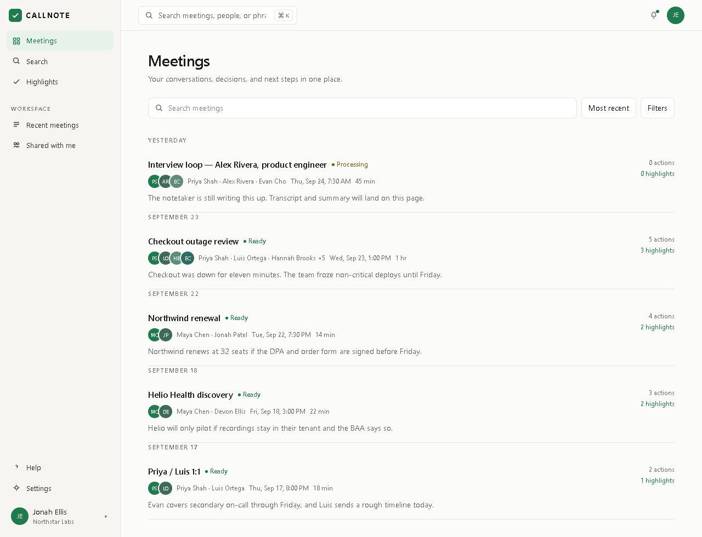
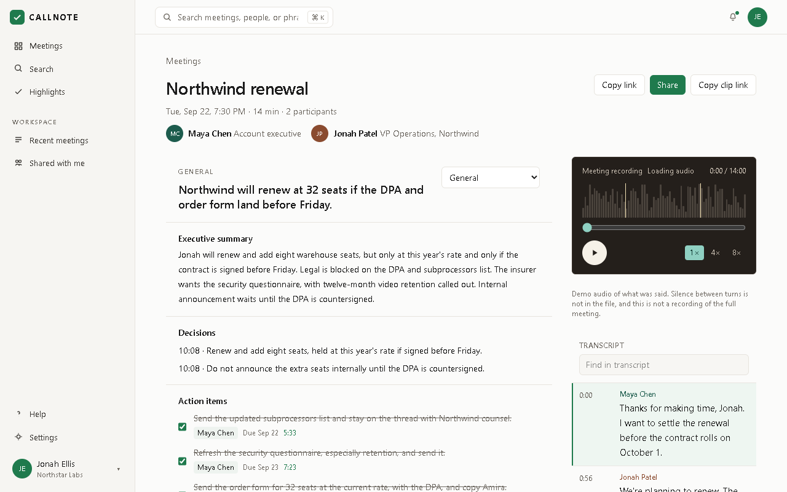
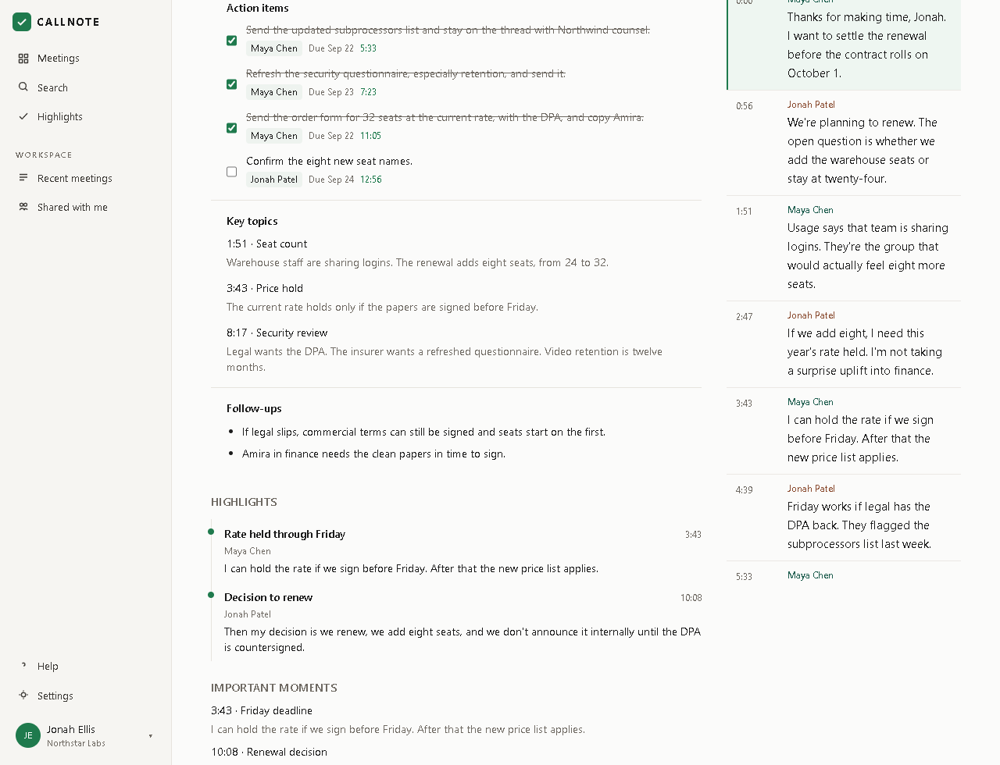
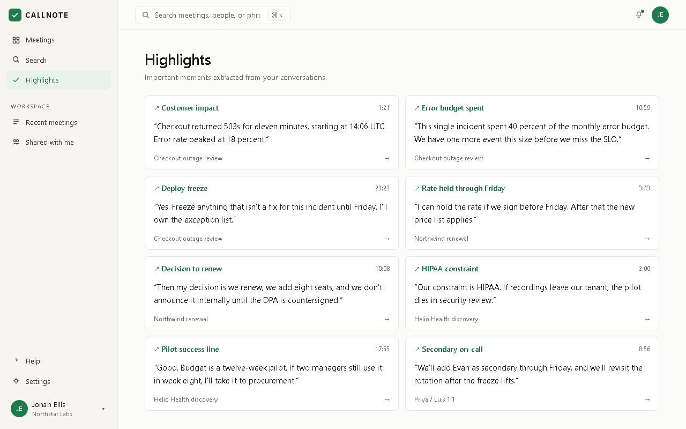
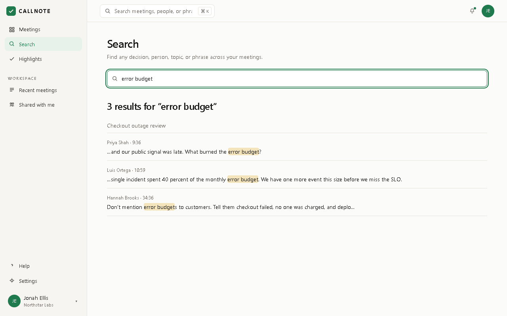
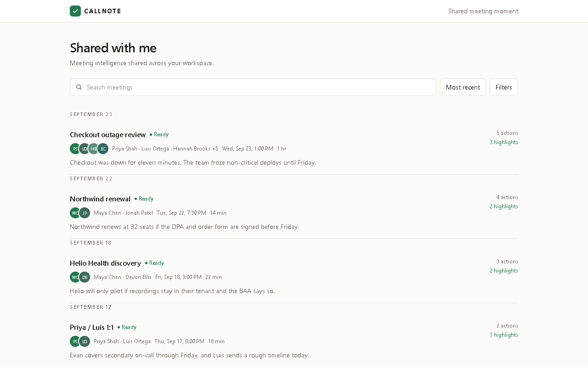
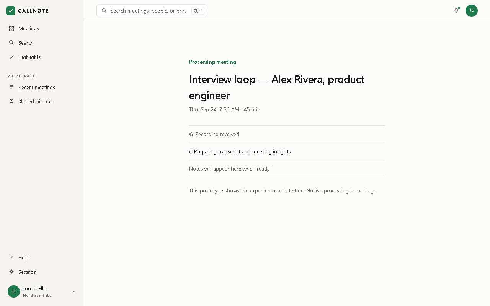
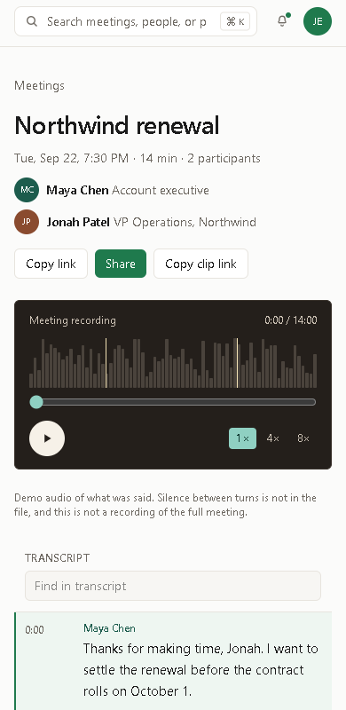

# Callnote

Meeting intelligence for the hour after the call: the line that was said, the decision, the owner, and a link you can send.

[Live demo](https://callnote-ten.vercel.app/) · [Repository](https://github.com/habinrahman/Callnote)

Next.js · React · TypeScript · Tailwind CSS · Supabase · PostgreSQL · Vercel

## Table of contents

- [Overview](#overview)
- [Product tour](#product-tour)
- [Feature documentation](#feature-documentation)
- [Meeting library](#meeting-library)
- [Meeting workspace](#meeting-workspace)
- [Playback and transcript](#playback-and-transcript)
- [Summaries and decisions](#summaries-and-decisions)
- [Action items](#action-items)
- [Highlights](#highlights)
- [Search](#search)
- [Shared meetings and public clips](#shared-meetings-and-public-clips)
- [Processing state](#processing-state)
- [Capture demo](#capture-demo)
- [Calendar demo](#calendar-demo)
- [Responsive design](#responsive-design)
- [Data and persistence](#data-and-persistence)
- [Architecture](#architecture)
- [API reference](#api-reference)
- [Database schema](#database-schema)
- [Project structure](#project-structure)
- [Local development](#local-development)
- [Deployment](#deployment)
- [Validation](#validation)
- [Product decisions](#product-decisions)
- [Known limitations](#known-limitations)
- [Assignment context](#assignment-context)
- [Agent-assisted development](#agent-assisted-development)
- [License](#license)
- [Author](#author)

## Overview

Callnote is a meeting-intelligence workspace for the period immediately after a meeting. The assignment pointed at that product category. The interface is this project's own workspace, not a copy of a vendor app.

The workflow the library is built around:

```text
Meeting → recording clock → transcript → summary → decisions → owners → actions → highlights → a link
```

You open a finished call, move the clock, read the matching line, and leave with an owner and something you can send. Five seeded meetings are already in the library, so the page is not empty and no account is required.

Notes, decisions, topics, follow-ups, and highlights are written in `lib/seed/meetings.ts`. Nothing calls a model at request time. Search is a case-insensitive substring match across the stored meetings. The write that is real is the action checkbox: a PATCH through a Next.js route handler into Supabase. After a full refresh, the same box is still checked.

The meeting bot and the calendar connection are stubs. The assignment allowed that. The time went into the page you use after the meeting.

## Product tour

Screenshots are from https://callnote-ten.vercel.app/.

### 1. Meetings library



The sidebar is Meetings, Search, Highlights, Recent meetings, Shared with me, Help, and Settings. The list shows a date, duration, people, a one-line preview, action count, and highlight count. Ready and Processing are separate labels.

Selecting a row opens `/meetings/[id]/`. The page loads that meeting from `GET /api/meetings/[id]/`. A ready meeting opens the workspace. A processing meeting opens the processing screen instead.

### 2. Meeting workspace



Northwind renewal is the detailed example: Maya Chen and Jonah Patel, 14 minutes, a player, the transcript beside it, an executive summary, and the decisions. The header has the time, duration, and participant count. Copy link, Share, and Copy clip link sit above the player.

The player label is "Meeting recording." Under it, the page says the audio is a demo of what was said, that silence between turns is not in the file, and that this is not a recording of the full meeting. Clicking a transcript line seeks the clock and marks that line active.

### 3. Action items



Each row is a task, an owner, a due date, and a checkbox. On this shot, three Northwind actions are checked and "Confirm the eight new seat names" is still open. Those checked values were written to Supabase. Reloading the page reads them back.

```text
Checkbox
   ↓
PATCH /api/meetings/[id]/actions/[actionId]/
   ↓
Supabase action_states
   ↓
GET /api/meetings/[id]/
   ↓
Persisted UI state
```

### 4. Highlights



The highlights page is a grid of cards: a label, a clock time, a quote, and the meeting title. Opening a card goes to that meeting at the moment's timestamp. The subtitle says the moments were extracted. They were written in the seed. No extraction job runs.

### 5. Search



Search for `error budget` returns three transcript hits inside Checkout outage review, with the speaker and the time. The match is a case-insensitive substring. It is not semantic search and it is not vector retrieval.

### 6. Shared with me



Shared with me lists the seeded meetings that have a public clip: Checkout outage review, Northwind renewal, Helio Health discovery, and Priya / Luis 1:1. Alex Rivera has no clip, so he is not in this list. It is not an inbox of files someone sent you.

A clip such as [Jonah's renewal decision](https://callnote-ten.vercel.app/share/northwind-decision/) opens with no account.

### 7. Processing



Interview loop — Alex Rivera stays on Processing in the library and on his own page. The page says "Processing meeting," lists "Recording received" and "Notes will appear here when ready," and states that no live processing is running. It does not invent a transcript or a summary.

### 8. Mobile



At 390px the Northwind player and transcript stay above the executive summary. The page does not scroll sideways. That viewport was checked in a browser against the production site.

## Feature documentation

### Meeting library

`GET /api/meetings/` returns summaries sorted by `startedAt` descending. Each summary includes status, participants, preview, duration, open action count, action count, and highlight count. Open actions are the items whose merged `done` value is false.

The five seeded meetings:

| Meeting | Id | Length | Status | Why it is here |
| --- | --- | --- | --- | --- |
| Northwind renewal | `northwind-renewal` | 14 min | Ready | Short sales renewal. The only seeded meeting with an audio file. Two people: Maya Chen and Jonah Patel. |
| Checkout outage review | `reliability-review` | 1 hr | Ready | Longer incident review. Eight people. No audio file. |
| Helio Health discovery | `helio-discovery` | 22 min | Ready | Discovery call. Recording and BAA constraints. |
| Priya / Luis 1:1 | `priya-luis-1on1` | 18 min | Ready | One-to-one. Secondary on-call and a timeline. |
| Interview loop — Alex Rivera, product engineer | `alex-interview` | 45 min | Processing | Visible in the library. Does not become Ready. |

Dates are formatted in UTC so the server render and the browser do not disagree.

### Meeting workspace

A ready meeting is `components/meeting-workspace.tsx`. The left side is the player and the transcript. The right side, on a wide screen, is the structured notes. On a narrow screen those notes follow the transcript.

The meeting object is one JSON payload: speakers, segments, templates, decisions, action items, topics, highlights, moments, and clips. `GET /api/meetings/[id]/` returns that payload with each action's `done` flag replaced by the row in `action_states` when one exists.

A template select changes headings. `structureFromTemplate` in `lib/intelligence/present.ts` maps `incident`, `sales`, `discovery`, and `interview` to their own section lists. Any other template id, including `follow-up`, `mutual-plan`, and `coaching`, uses the general headings. Checkout outage review stores an incident template, so choosing Incident review changes both headings and the summary text that belongs to that template. On a meeting that does not store the id you picked, the headings still change and the prose stays the meeting's own template. Some sections `take` or `skip` items from the same arrays, so a heading can sit on a fact that was not written for that heading.

General headings, which Northwind uses by default:

- Executive summary
- Decisions
- Action items
- Key topics
- Follow-ups

### Playback and transcript


Northwind is the only seeded meeting with a media file: `public/audio/northwind-renewal.wav`. `lib/audio/northwind-demo.ts` maps each spoken line's meeting time onto a span of that file. The file is concatenated spoken lines, about 108 seconds, not a room recording of the 14-minute meeting. The player says so.

While that file is playing, the meeting clock follows the cue map. At the end of a cue the player jumps to the next cue instead of playing the silence that was never recorded. Seeking waits until the browser can seek that far before it assigns `audio.currentTime`. Otherwise Chrome can snap the element back to the start and the transcript follows it.

Every other ready meeting has no media file. Play runs a timer. `nextPlayhead` in `lib/domain/format.ts` skips a gap longer than 1.5 seconds so the transcript keeps moving. The duration on screen is `durationSec` from the meeting, not `audio.duration`. The waveform is decorative. It is not drawn from samples. Playback rates on the control are 1×, 4×, and 8×.

Each transcript line has a speaker, a start, and an end. `layOut` in `lib/seed/build.ts` estimates spoken time from the word count, then spreads the rest of the meeting across the gaps. The active line is the one that contains the playhead (`data-active`). Clicking a line calls `seek` and writes `?t=` so refresh and paste reopen that moment. The in-transcript filter is a substring over the lines on the page.

### Summaries and decisions

Summaries, decisions, topics, actions, moments, and follow-ups are fields on the meeting. They are not requested from a service. They match the transcripts because they were written against those lines.

`lib/intelligence/present.ts` only chooses section kinds: prose, points, actions, topics, moments, or a list. A later caller could fill those kinds from a model. This repository does not.

Customer follow-up, Mutual plan, and 1:1 (`follow-up`, `mutual-plan`, `coaching`) swap the written summary and keep the general headings. `structureFromTemplate` has no section list for those ids.

### Action items


An action item has:

| Field | Meaning |
| --- | --- |
| `id` | Stable id, for example `nw-a2` |
| `task` | The sentence on the row |
| `owner` | Name shown under the task |
| `due` | Date, formatted in UTC |
| `timestampSec` | Where the task sits on the meeting clock |
| `done` | Checkbox. Seeded value lives in the payload. The stored value lives in `action_states`. |

`action_states` is separate from the payload so a checkbox write does not rewrite the seeded meeting document. On read, `lib/db.ts` overlays `action_states.done` onto each action. If no row exists for that id, the payload's own `done` is used.

Lifecycle for a seeded meeting:

```text
User clicks the checkbox
        ↓
The workspace sends PATCH with { "done": true } or { "done": false }
        ↓
The route rejects a non-boolean done with HTTP 400
        ↓
setActionDone loads the meeting and rejects an unknown action id
        ↓
Supabase upserts action_states on (meeting_id, action_id)
        ↓
The route returns the meeting again
        ↓
A later GET, including a full refresh, merges the same row
```

Confirmed in `app/api/meetings/[id]/actions/[actionId]/route.ts` and `setActionDone`:

- `done` is not a boolean → HTTP 400, `{ "error": "done must be boolean" }`
- Missing meeting, or an action id that is not on that meeting → HTTP 404, `{ "error": "Not found" }`
- Success → HTTP 200 and the full meeting JSON

That path was checked on production: a Northwind action was checked, the page was reloaded, and it stayed checked.

Captured meetings do not use this API. Their checks stay in `localStorage` under `fanthom-actions-${meetingId}`.

### Highlights


A highlight has an id, a label, an excerpt, a speaker, and `startSec`. `GET /api/highlights/` flattens them across stored meetings and adds `meetingId`, `meetingTitle`, and `speakerName`.

The highlights page links each card to `/meetings/[id]?t=` at that second. Seeded highlights also render inside the meeting workspace. They are authored fields. The page subtitle still says they were extracted. They were not.

### Search


`GET /api/search/?q=` runs `searchMeetings` in `lib/domain/queries.ts` over the meetings loaded from Supabase. Processing meetings are skipped.

For each ready meeting the matcher looks at:

- the title
- each template's headline, executive summary, and follow-ups (one summary hit, then it stops)
- each action's task and owner
- transcript lines, at most three per meeting

The comparison is `toLowerCase().includes`. A transcript hit keeps a short window around the match, the speaker name, and `timestampSec`. An empty query returns no hits.

The search page's empty state offers recent chips: `error budget`, `pricing approval`, and `customer expansion`. Submitting from the meetings page search also goes to `/search/?q=`.

### Shared meetings and public clips


`GET /api/meetings/?shared=1` keeps meetings whose `clips` array is not empty. The Shared with me page renders those rows.

Public clip routes, from the seed:

| Route | Title |
| --- | --- |
| `/share/northwind-decision/` | Jonah's renewal decision |
| `/share/reliability-freeze/` | The deploy freeze |
| `/share/helio-hipaa/` | The HIPAA line |
| `/share/priya-secondary/` | Secondary on-call |

`getClip` slices the meeting transcript to the clip's start and end. The clip page has no library sign-in. There is no account, no private link, and no revocation. A captured recording can be opened on this browser at `/share/captured/`, with the blob still in IndexedDB. Another person cannot open that recording.

### Processing state


Alex Rivera is stored with `status: "processing"`. The library shows him as Processing. Opening the meeting does not render the workspace. `components/meeting-route.tsx` shows:

- Processing meeting
- the title, time, and duration
- Recording received
- Preparing transcript and meeting insights
- Notes will appear here when ready
- "This prototype shows the expected product state. No live processing is running."

He never becomes Ready. That is intentional, so the state can be reviewed without waiting on a job that does not exist. Search ignores him because `searchMeetings` skips any meeting that is not `ready`.

### Capture demo

Capture is a second path, not the seeded library.

**Start recording** calls `getUserMedia` and `MediaRecorder`, preferring `audio/webm;codecs=opus`, then webm, then mp4. If the microphone is denied, or those APIs are missing, the page stays on a denied state. Stop shows **Processing meeting** for about 1.6 seconds. The copy on that screen says demo transcript events are used and this is not live speech-to-text.

The blob, the scripted lines that had already started, and the prewritten notes are stored in IndexedDB (`callnote-capture`). The browser then opens `/meetings/captured/?id=`. Highlights made during capture stay in that same database. Action checks on a captured meeting stay in `localStorage`. None of that is written to Supabase. Another browser, or another person, cannot open it.

### Calendar demo

[Calendar](https://callnote-ten.vercel.app/calendar/) is not in the main sidebar. It is a demo list. The page says Callnote does not call Google or Microsoft.

**Connect calendar** writes `{ provider, name: "Jordan Lee" }` to `localStorage` (`callnote-calendar-demo`) and shows **Demo connection**. Nothing is sent to Google or Microsoft.

Checkout outage review on the calendar is 60 minutes, eight participants, labeled Google Meet, with **Open saved meeting** into the seeded workspace. Other cards can open **Start Callnote**. The ready screen says recording uses this browser's microphone and does not join the named platform. **Notetaker scheduled** on the Helio card is a label, not a bot.

### Responsive design


The meeting page was checked at 390×800 on the production site. The transcript region sits above the Executive summary heading. `documentElement.scrollWidth` was not wider than the viewport. The sidebar collapses into the narrow header. Playback controls, the transcript filter, and the action list remain on the page.

## Data and persistence

| Data | Storage | Survives refresh? | Server-side? |
| --- | --- | --- | --- |
| Seeded meetings | Supabase `meetings.payload` | Yes | Yes |
| Action `done` for seeded meetings | Supabase `action_states` | Yes | Yes |
| Captured recording blob | IndexedDB `callnote-capture` | Yes, in that browser | No |
| Captured notes and lines | IndexedDB `callnote-capture` | Yes, in that browser | No |
| Captured highlights | IndexedDB `callnote-capture` | Yes, in that browser | No |
| Captured action checks | `localStorage` key `fanthom-actions-${id}` | Yes, in that browser | No |
| Demo calendar connection | `localStorage` key `callnote-calendar-demo` | Yes, in that browser | No |

"Yes, in that browser" means the data is still there after reload on the same origin. It is not shared, and clearing site data removes it.

## Architecture

Frontend: Next.js App Router, React, TypeScript, Tailwind CSS. Backend: Next.js route handlers on the Node.js runtime. Database: Supabase PostgreSQL. Deployment: Vercel, from the `master` branch.

```text
┌──────────────────────────┐
│        Browser           │
│ React / Next.js UI       │
└────────────┬─────────────┘
             │
             ▼
┌──────────────────────────┐
│ Next.js Route Handlers   │
│ Node.js runtime          │
└────────────┬─────────────┘
             │
             ▼
┌──────────────────────────┐
│ Supabase PostgreSQL      │
│                          │
│ meetings                 │
│ action_states            │
└──────────────────────────┘
```

```text
GitHub
   → Vercel
   → Next.js Node.js runtime
   → Supabase
```

The browser does not call Supabase. `lib/db.ts` imports `server-only` and reads `SUPABASE_URL` and `SUPABASE_SECRET_KEY`. Those names are not prefixed with `NEXT_PUBLIC_`, so Next.js does not inline them into the client bundle. `SUPABASE_SECRET_KEY` is the service role key. It bypasses row level security. The tables have RLS enabled and no anon or public policies, so a browser client without that key cannot read or write them.

Each API route sets `export const runtime = "nodejs"`.

`NEXT_PUBLIC_BASE_PATH` is optional. Production does not set it, so routes are at the site root. When it is set, client fetches from `lib/api-path.ts` and copied links prefix it. There is no static export, and this app is not deployed to GitHub Pages.

### Data flow

Meeting list:

```text
Browser
  → GET /api/meetings/
  → Supabase meetings, with action_states merged in
  → meeting rows
```

Meeting detail:

```text
Browser
  → GET /api/meetings/[id]/
  → Supabase
  → meeting workspace
```

Action persistence:

```text
Browser
  → PATCH /api/meetings/[id]/actions/[actionId]/
  → upsert action_states
  → later GET
  → same done value
```

The PATCH body is `{ "done": true }` or `{ "done": false }`. A non-boolean `done` is HTTP 400. A missing meeting or action id is HTTP 404. Unknown action ids are rejected. Captured recordings still keep their own checks in `localStorage`. The seeded library does not.

Seeded pages can still be prerendered for their shells. The meeting body is loaded in the browser from the API after navigation. `scripts/seed-supabase.ts` runs once, and only when `meetings` has no rows. It is not called on each request or on a cold start.

## API reference

| Method | Route | Purpose | Storage |
| --- | --- | --- | --- |
| GET | `/api/meetings/` | List meetings. `?shared=1` keeps meetings that have a clip. | Supabase |
| GET | `/api/meetings/[id]/` | One meeting, with action `done` merged from `action_states`. | Supabase |
| GET | `/api/search/?q=` | Search ready meetings. | Supabase, then in-process match |
| GET | `/api/highlights/` | Flatten seeded highlights. | Supabase payload |
| PATCH | `/api/meetings/[id]/actions/[actionId]/` | Set `done` for one action. | Supabase `action_states` |

### GET `/api/meetings/`

Returns meeting summaries, newest `startedAt` first. `?shared=1` filters to `clips.length > 0` before summarizing.

### GET `/api/meetings/[id]/`

Returns the meeting JSON, or HTTP 404 `{ "error": "Not found" }`.

### GET `/api/search/`

Reads `q`. An empty query returns an empty array. Hits are title, summary, action, or transcript, as described above. At most three transcript hits per meeting.

### GET `/api/highlights/`

Returns the highlight objects plus `meetingId`, `meetingTitle`, and `speakerName`.

### PATCH `/api/meetings/[id]/actions/[actionId]/`

Request:

```json
{ "done": true }
```

`done` may be `false`.

| Result | Status | Body |
| --- | --- | --- |
| Updated | 200 | The full meeting, with `done` merged |
| `done` is missing or not a boolean | 400 | `{ "error": "done must be boolean" }` |
| Meeting missing, or action id not on that meeting | 404 | `{ "error": "Not found" }` |

The handler does not invent a partial action object. Success and the follow-up GET both return the meeting.

## Database schema

Two tables, from `supabase/schema.sql`. The meeting document is not split into more tables.

```text
meetings
  id text  PK
  payload jsonb  NOT NULL
        │
        │ ON DELETE CASCADE
        ▼
action_states
  meeting_id text  ──┐
  action_id  text  ──┴─ PK
  done boolean NOT NULL
```

### meetings

| Column | |
| --- | --- |
| `id` | text, primary key |
| `payload` | jsonb, not null |

`payload` is the meeting: speakers, transcript, summary, decisions, actions, topics, highlights, moments, and clips.

### action_states

| Column | |
| --- | --- |
| `meeting_id` | text, not null, references `public.meetings(id)` on delete cascade |
| `action_id` | text, not null |
| `done` | boolean, not null |

Primary key is `(meeting_id, action_id)`. Deleting a meeting deletes its action rows.

Row level security is enabled on both tables. There are no anon or public policies. The Next.js server uses the service role key.

Seed data is inserted once by `scripts/seed-supabase.ts`, and only when `meetings` is empty. The script is not called on each request. Applying the SQL is a separate step in the Supabase SQL editor. The app does not run `CREATE TABLE` on startup.

## Project structure

```text
Callnote/
├── app/
│   ├── api/                 route handlers
│   ├── meetings/            library, [id], captured
│   ├── search/
│   ├── highlights/
│   ├── shared/
│   ├── share/               public clips and captured share
│   ├── help/
│   ├── settings/
│   └── calendar/            demo calendar, not in the main sidebar
├── components/              shell, workspace, player, transcript, capture
├── lib/
│   ├── db.ts                Supabase access used by the API
│   ├── seed/                meeting text and transcript timing
│   ├── domain/              types, UTC formatting, search
│   ├── intelligence/        template headings, no network
│   ├── audio/               Northwind cue map
│   └── capture/             IndexedDB and the demo calendar key
├── scripts/                 one-shot seed and verify-demo.mjs
├── supabase/schema.sql
├── public/audio/            northwind-renewal.wav
├── docs/images/             screenshots in this README
└── .agent-logs/             agent session logs
```

`lib/db.ts` is the only module the API uses to read and write Supabase. `lib/seed/meetings.ts` is the meeting text the seed script inserts.

## Local development

Requirements: Node.js 22 is what this project was built with. npm. A Supabase project with the two tables. Chrome, only if you run `scripts/verify-demo.mjs`.

```bash
git clone https://github.com/habinrahman/Callnote.git
cd Callnote
npm install
```

Create `.env.local` in the project root. Do not commit it. `.gitignore` already ignores `.env` and `.env.*`, and keeps `.env.example`.

```text
SUPABASE_URL=
SUPABASE_SECRET_KEY=
```

`SUPABASE_SECRET_KEY` is the service role key. Keep it on the server. Do not prefix it with `NEXT_PUBLIC_`.

Apply `supabase/schema.sql` once in the Supabase SQL editor if the tables are not there yet. Then:

```bash
npx tsx scripts/seed-supabase.ts
npm run dev
```

Open http://localhost:3000. If `meetings` already has rows, the seed script exits without inserting again.

```bash
npx tsc --noEmit
npm run build
npm run start
```

```powershell
$env:DEMO_URL="http://127.0.0.1:3000"
node scripts/verify-demo.mjs
```

`scripts/verify-demo.mjs` launches Chrome through Playwright (`playwright-core`) at `C:\Program Files\Google\Chrome\Application\chrome.exe`. It fails if a page throws. There is no `npm test` script.

## Deployment

```text
GitHub  →  Vercel  →  Next.js Node.js runtime  →  Supabase PostgreSQL
```

Production is https://callnote-ten.vercel.app/, deployed from the `master` branch.

The Vercel project needs the same two variables, set for Production, without the `NEXT_PUBLIC_` prefix:

```text
SUPABASE_URL
SUPABASE_SECRET_KEY
```

Do not put the values in the repository. The secret stays in the server environment because the route handlers are the only callers of Supabase. A name that starts with `NEXT_PUBLIC_` would be copied into browser JavaScript.

Routes on this deployment are at the site root (`/`, `/meetings/northwind-renewal/`, `/api/meetings/`). Trailing slashes are on.

## Validation

Checked against this codebase and against https://callnote-ten.vercel.app/:

| Area | Status |
| --- | --- |
| `npx tsc --noEmit` | Pass |
| `npm run build` | Pass |
| `scripts/verify-demo.mjs` on a local production server | Pass |
| Meetings library, five meetings, Ready and Processing | Pass |
| `GET /api/meetings/` | Pass |
| Search for `error budget` | Pass |
| Highlights page | Pass |
| Shared with me | Pass |
| Northwind playback, transcript seek, summary, decisions, actions | Pass |
| Action checkbox still checked after a full refresh | Pass |
| Public clip `/share/northwind-decision/` with no login | Pass |
| Alex Rivera processing copy | Pass |
| Help | Pass |
| Settings | Pass |
| Northwind at 390px, transcript above summary, no horizontal overflow | Pass |

## Product decisions

The assignment allowed the capture layer to be stubbed. This project did not spend the build on a production recording bot. It spent it on the hour after the call: what was said, what was decided, who owns the next step, and what can be sent as a link.

Seeded meetings make the product reviewable without an account, an external model key, calendar OAuth, or a bot that joins a call. Northwind is the short, audible meeting. Checkout outage review is the longer one: about an hour, eight people, no audio file. Alex Rivera is the processing fixture and does not flip to Ready by itself. Helio and the Priya / Luis 1:1 fill out discovery and a one-to-one.

The action checkbox is a real write so the backend is not a static page that only looks interactive. Search, highlights, and the public clip are on the same server path: the browser asks Next.js, and Next.js reads Supabase.

The processing screen exists so the library can show an unfinished meeting without filling it with a fake transcript. The calendar and the microphone path exist so the stub is visible and labeled, not hidden behind a button that claims a bot joined Zoom.

## Known limitations

Integrations

- No calendar OAuth. Connect calendar writes a demo flag to `localStorage`.
- No meeting bot. "Notetaker scheduled" is a label.
- No accounts, no private links, no revocation.

Intelligence

- No external model. Summaries are not requested from a service.
- Highlights are authored. The highlights page still says they were extracted.
- Search is not semantic. It is a case-insensitive substring, with at most three transcript hits per meeting.
- Template headings can change when the meeting has no prose written for that template. Customer follow-up, Mutual plan, and 1:1 swap the summary and keep the general headings.

Audio

- One seeded audio file. Concatenated spoken lines, about 108 seconds, mapped onto the 14-minute Northwind meeting. Not a room recording.
- Other ready meetings play a timer. Gaps longer than 1.5 seconds are skipped.
- The waveform is decorative.

Processing

- Alex Rivera never leaves Processing.
- No live processing job. The page says so.

Capture

- Microphone audio, scripted lines, notes, and highlights stay in IndexedDB on that browser.
- Captured action checks stay in `localStorage`.
- Another person cannot open that recording.
- If the IndexedDB write fails, the processing panel stays up. The 1.6 second timeout does not wait on real transcription.

Sharing

- Shared with me is the seeded meetings that have a clip. It is not a share inbox.

## Assignment context

The 8x brief asked for a meeting product and allowed the notetaker itself to be stubbed. Callnote uses its own layout, a real Next.js API, and Supabase for the seeded library and for action checks. The data is seeded and specific. Capture and calendar are demos, and the screens say so. The scope is the post-meeting workflow: playback, transcript, decisions, owners, persistence, search, highlights, and a public clip.

## Agent-assisted development

`.agent-logs/` is part of the repository. It holds session logs captured while the project was built in Cursor. The assignment asked for that record. The files are markdown session logs. They are not a runtime dependency of the app.

## License

No license file is included in this repository.

## Author

Habin Abdul Rahman — https://github.com/habinrahman
